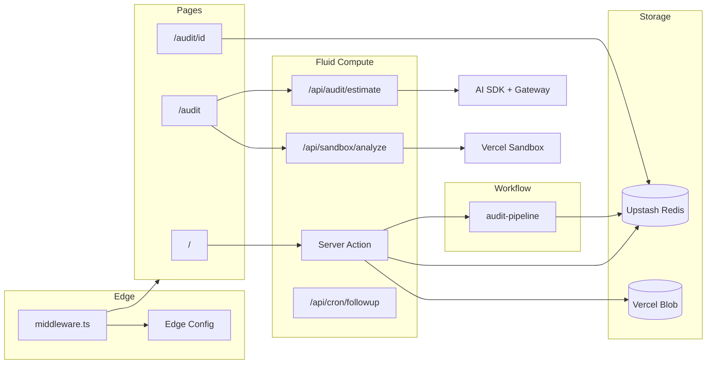
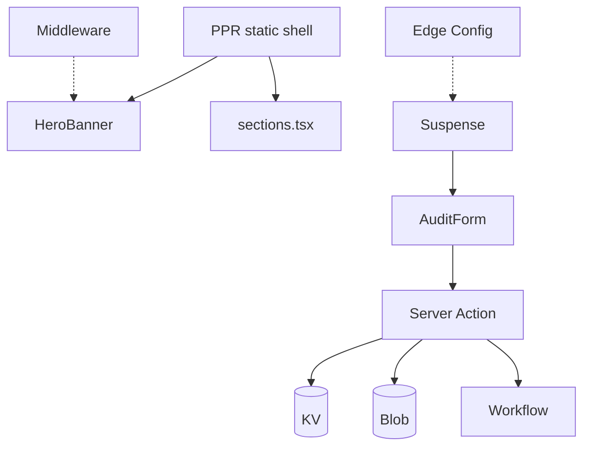
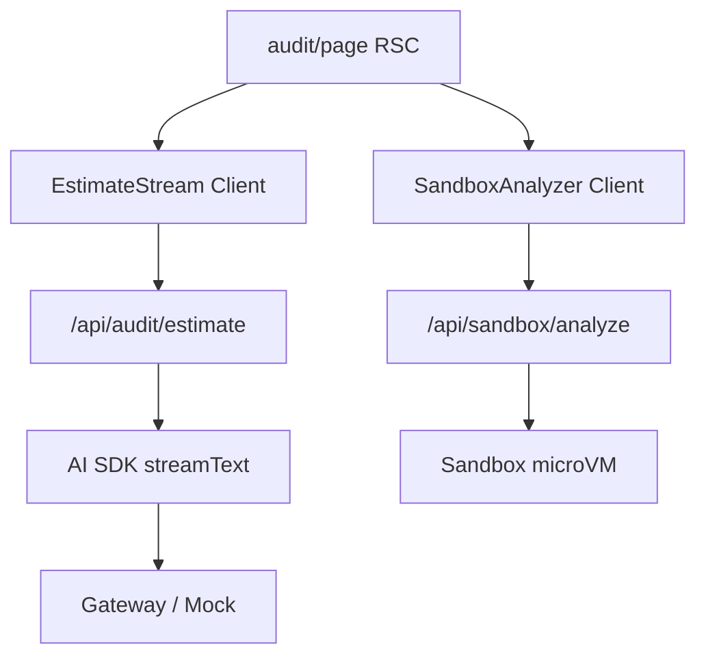
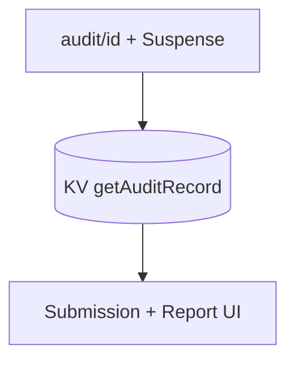

# Architecture map (minimized)

## System overview

---

## Pages

| Page | File | Vercel layer | Data flow |
|------|------|--------------|-----------|
| `/` | `app/page.tsx` | **Cache Components (PPR)**, RSC, Suspense | Static shell + streamed form flags |
| `/audit` | `app/audit/page.tsx` | RSC + **Client** islands | Loads estimate + sandbox UI |
| `/audit/[id]` | `app/audit/[id]/page.tsx` | **PPR** + Suspense, dynamic | Reads audit from **KV** |
| `layout` | `app/layout.tsx` | RSC | **Speed Insights**, **Analytics**, fonts |

---

## API & server

| Route / action | File | Vercel layer |
|----------------|------|--------------|
| `submitAudit` | `app/actions/submit-audit.ts` | **Server Actions**, Zod |
| `POST /api/audit/estimate` | `app/api/audit/estimate/route.ts` | **Fluid Compute**, **AI SDK** `streamText` |
| `POST /api/sandbox/analyze` | `app/api/sandbox/analyze/route.ts` | **Fluid Compute**, **Sandbox** |
| `GET /api/cron/followup` | `app/api/cron/followup/route.ts` | **Cron Jobs** |
| `runAuditPipeline` | `workflows/audit-pipeline.ts` | **Workflow SDK** (`use workflow` / `use step`) |
| `/.well-known/workflow/*` | auto (Workflow) | Workflow runtime webhooks |

---

## Components

| Component | File | Renders on | Vercel layer |
|-----------|------|------------|--------------|
| `SiteHeader` | `components/site-header.tsx` | all pages | RSC (static) |
| `HeroBanner` | `components/landing/hero-banner.tsx` | `/` | RSC + **Middleware** headers (geo, A/B) |
| `AudiencesSection` etc. | `components/landing/sections.tsx` | `/` | RSC (PPR static shell) |
| `AuditForm` | `components/landing/audit-form.tsx` | `/` | **Client** → **Server Action** → KV, Blob, Workflow |
| `EstimateStream` | `components/audit/estimate-stream.tsx` | `/audit` | **Client** → `useCompletion` → AI SDK stream |
| `SandboxAnalyzer` | `components/audit/sandbox-analyzer.tsx` | `/audit` | **Client** → Sandbox API |
| `PlatformLayers` | `components/platform-layers.tsx` | `/`, `/audit` | RSC (docs checklist) |

---

## Lib modules

| Module | File | Vercel layer |
|--------|------|--------------|
| Feature flags | `lib/edge-config.ts` | **Edge Config** |
| Audit storage | `lib/kv.ts` | **Upstash Redis** (KV) |
| File uploads | `lib/blob.ts` | **Vercel Blob** |
| Report logic | `lib/audit-report.ts` | Server (shared by Action + Workflow) |
| Model routing | `lib/ai/gateway.ts` | **AI Gateway** / OpenAI / Anthropic |
| Mock stream | `lib/ai/mock-provider.ts` | **AI SDK** (demo provider) |
| Sandbox analysis | `lib/sandbox/analyze.ts` | **Vercel Sandbox** (+ local fallback) |
| `cn()` | `lib/utils.ts` | — |

---

## Cross-cutting

| Concern | Where | Vercel layer |
|---------|-------|--------------|
| Geo + A/B + bot hint | `middleware.ts` | **Edge Middleware** |
| PPR / `use cache` | `next.config.ts` | **Cache Components** |
| Workflow bundling | `next.config.ts` `withWorkflow()` | **Workflow SDK** |
| WAF / BotID | dashboard | **Firewall**, **BotID** (see `FIREWALL.md`) |
| Canary deploys | dashboard | **Rolling Releases** (see `ROLLING_RELEASES.md`) |
| PR review | dashboard | **Vercel Agent** |

---

## Per-page diagram (minimal)

### `/` (landing)

### `/audit` (tools)

### `/audit/[id]` (report)

